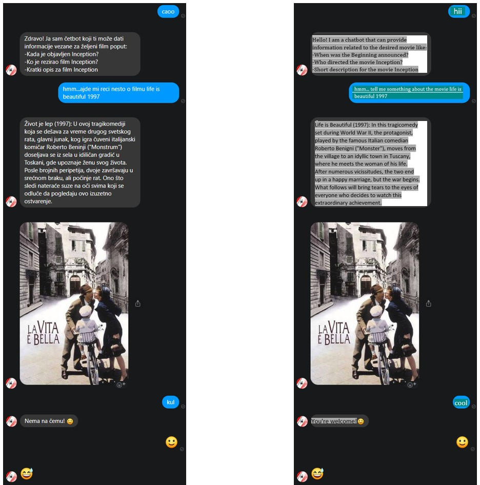
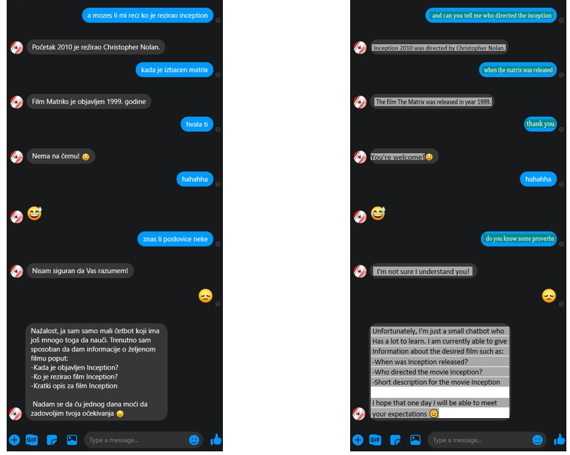

# Filmmate - NLP Messenger chatbot for movies
 ## Descirption:
 Messenger NLP-based movie chatbot that is implemented using NLU of Wit.ai & NodeJs for the backend.

 ## How it works:
 The bot integrates with the themoviedb API that feeds it with data about a specific movie you have asked for, so all you have to do is to send the message to the bot asking about desired movie (optimised for Serbian language) and you get the asked information as a response on Serbian.
 You can ask chatbot about the details for desired movie such as - when particular movie was released, who directed it, or just ask for summary of movie you are interested in.

 ## Screen shots:
 
 Original conversation (Serbian) & Conversation translated on English:

 
 
 ----------------------------------------------------

 ## Featured technologies, 3rd party solutions & used platforms
* [Node.js](https://nodejs.org/): An asynchronous event driven JavaScript runtime, designed to build scalable applications.
* [Wit.ai](https://wit.ai/): A natural language interface for applications capable of turning sentences into structured data.
* [themoviedb.org](https://developers.themoviedb.org/): Free and open movie database.
* [Messenger platform](https://developers.facebook.com/docs/messenger-platform/): Facebook chatting platform where developers can create independent, third party apps that can plug into the Messenger app, enhancing the functionality
* [Heroku](https://dashboard.heroku.com/): Heroku is a platform as a service (PaaS) that enables developers to build, run, and operate applications entirely in the cloud.

 ## Additional
 Additionally, I have made ejs file to serve as my home page, then added chat plugin to integrate Messenger chatbot directly into my heroku hosted website

 ## Final talk:
 This project is deployed on free dyno on Heruko, so after not usage or spending my free dyno hours that I get each month, it'll go to sleep until I wake him up again. But, if that happend, you know that sleep makes human digest knowledge, so as we, he may come smarter. Greetings up until my next project!